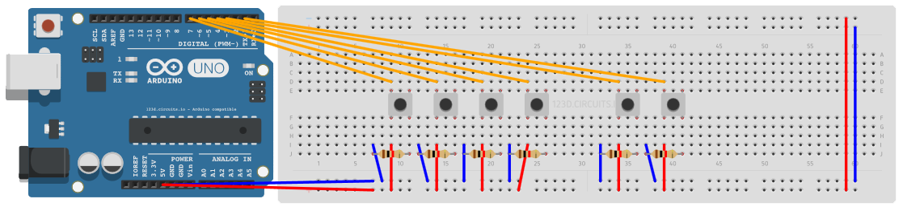
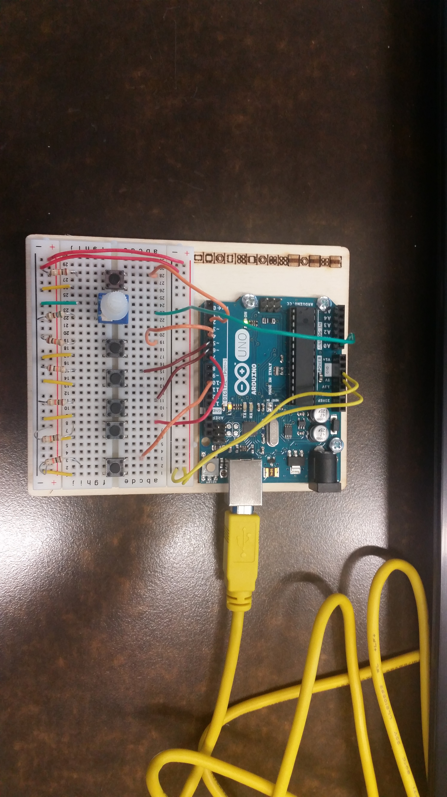
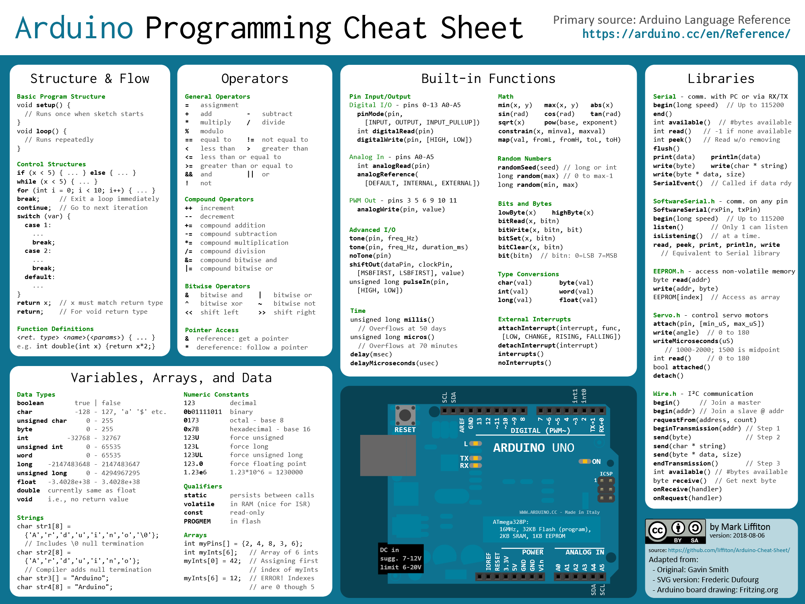

# 🎮 IoT Arduino Game Controller Java ☕️
🎮 A **Game controller** realized with an **Arduino**, I modified the **Arduino** bootloader to program with **Java** ☕️

Don't get me wrong, I can easily program this in standard C too, but I like the aspects of **OOP (object-oriented programming)**. 
That's the reason why I mostly prefer **Java** / C++ over ANSI C.

([**JArduino**](https://github.com/SINTEF-9012/JArduino)) was used in this project to communicate with the Pins (GPIO) of the **Arduino**.

In this project I used my own written **Java** Classes ([**Mouse**](https://github.com/AYIDouble/Mouse)) and ([**Keyboard**](https://github.com/AYIDouble/Keyboard)) to send signals to the Mouse and the Keyboard, when buttons on the **Game Controller** are being pressed.

## ⚙️ Concept ⚙️

## 🖼 Images 🖼

## 📝 Notes 📝

### In the context of Arduino

- **Digital** means **0 or 1 (1-Bit)**
- **Analog** means a number between **0 ... 255 (8-Bit)**
- The **Output** of the Arduino is **40 Milliampere (mA)**

### 📝 Cheatsheet 📝

